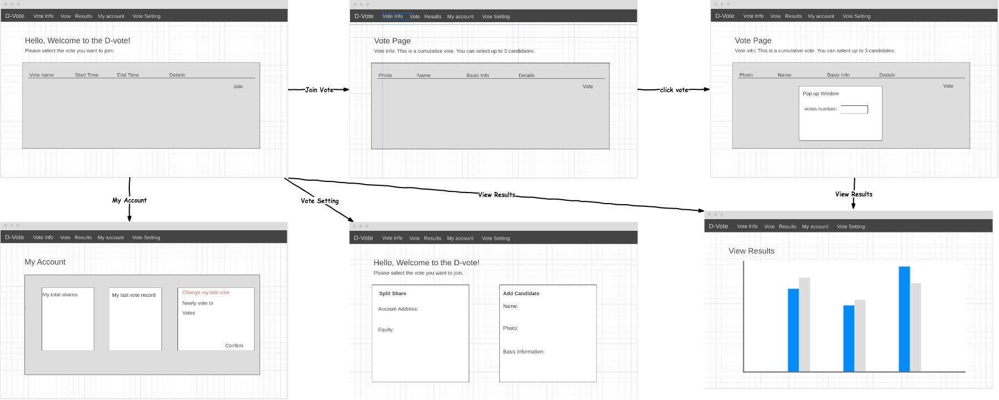

# EECE571G_BLOCKCHAIN_Final_Project
## Due
Mar. 23rd, 2020
## Basic Info
  Project Name: Vote System
  
  Group Name: TBD.
  
  This is the repository for UBC EECE571G Blockchain Software Engineering Project, 2020.
  
  Steps:
  1. cd client : npm install
  2. New workspace in Ganache with truffle-config.js under root
  3. truffle compile
  4. truffle migrate --reset
  5. (Resolved, do need to do this step)My abi file is placed in default folder(build/contract), otherwise my truffle can't modify the .json file(don't know why). Please copy all the json files into src/contracts after running "migrate"!!! Then the App.js can access the contract abi
  6. type "npm start" under ./client
  7. Copy first account key from Ganache and import into metamask with new created account
  9. Refresh the page
## Features
   This Dapp is for straight voting and cumulative voting on the blockchain.
   
   What is the difference between straight voting and cumulative voting? -> see here[https://tremblylaw.com/cumulative-and-straight-voting-know-the-difference/]
   
   So this Dapp can let you choose:
   
   1. The voting type
   2. Number of total shares
   3. Number of open seats
   4. Max number of shares per voter
   5. Voting start date and end date
   6. Open seats info. modifying start date and end date
   
   Also, it has the following functions:
   
   1. Insert Candidate Information ** Can only be done by deployer **
   2. Deploy shares to shareholder  ** Can only be done by deployer **
   3. Vote for multiple candidate (But you can't exceed the number of open seats, and can't exceed your shares)
   4. Change the your vote (You have 3 chances to change your vote)
   5. View your vote
   6. View the vote of each candidate

## Framework
### Back-end
solidity + truffle + Ganache

### Front-end
react + web3 + bootstrap

Wireframe:

## TODO

- [ ] Front-end components
- [ ] truffle test
- [x] WireFrame
- [x] Smart contract V1.0
- [ ] Whitepaper

## Future Development

* Can deploy multiple votings for a company
* Can deploy different shares of different companies
* Can deploy multiple votings for different companies

