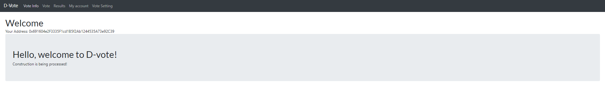
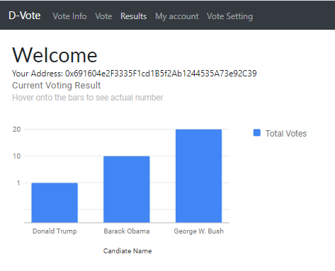
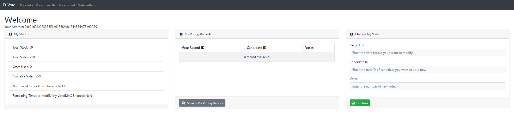
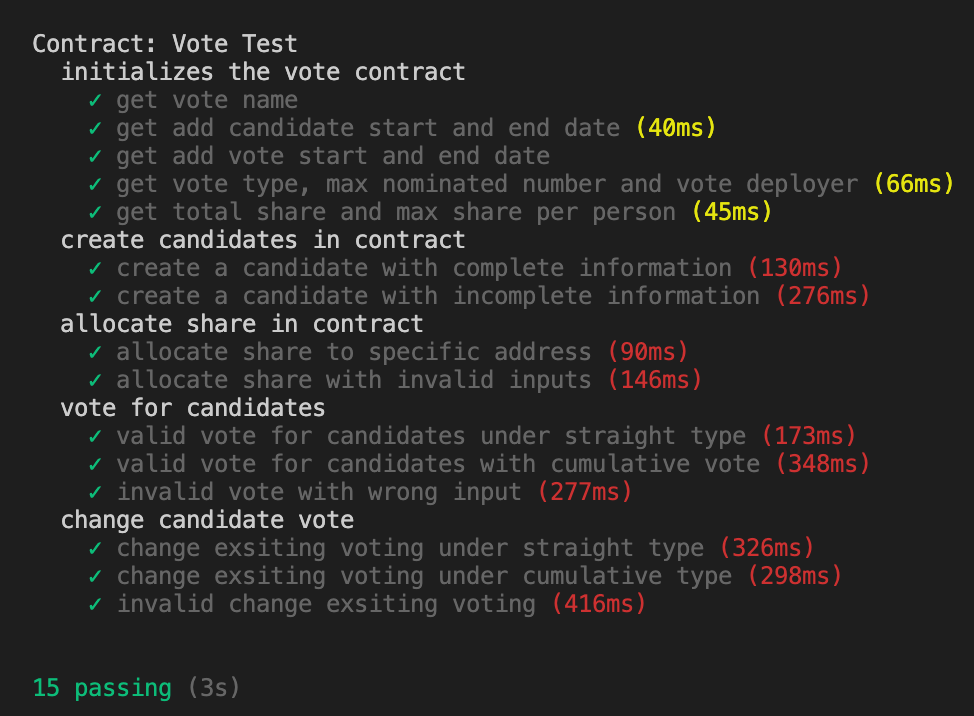

# Blockchain Global Voting System

# Group TBD.

-   XIAOJUN TIAN 11240587
-   LIMING LIU 95660163
-   YUEWEI LUO 14152342
-   JIAHAO LI 50462670

## Introduction

From the US presidential election to student association resolution, voting is a common but indispensable activity in our daily life. However, the traditional voting systems, either on-site or online, always have some disadvantages because of their natural form and restrictions using traditional technologies. In this project, we designed the smart contract and implemented a voting system using blockchain technology. By applying the two most important features, cryptography and decentralization, the security and reliability of the voting process is guaranteed.

### Disadvantages of traditional on-site voting

-   People need to go to the voting polls in person and wait in a long line (Persidential Election)
-   Impossible to alter vote before the deadline if the voters change their mind
-   Hackers can apply malicious attack the back-end server/database and manipulate the results

### Advantages of online voting through Blockchain

-   The voting results are public and immutable
-   The decentralized network can help prevent malicious attack
-   People can vote anywhere where the Internet is accessible
-   People have the authority to alter their vote before the deadline in case that they change their mind
-   Real-time voting results are always visible to everyone

    

## Objectives

The functionalities of our voting system are divided into 3 parts, from basic to advanced based on the importance of these functions to the system. Some of the advanced functionalies may not be able to finish before the deadline but we guarantee that all the basic and itermediate functions will be implemented.

### Basic Functions

#### Vote

There are two kinds of voting - straight and cumulative. In the straight voting, each voter can have one vote per share for each nominator. In other words, voters only need to select the candidates they intend to vote for, the votes for each candidate are fixed. In cumulative voting, each voter can vote candidates they want to vote with different votes number. There are several constraints on voting. For example, the voter should always vote before the deadline and should have never voted before. Besides, the candidates should be valid as well.

#### Inquire

Under Inquire, firstly, voters can check their account share details which includes: Total share, Total Votes, Votes Used, Available Votes, Number of voted Candidates , Remaining Times to Modify My Vote(MAX 3 times); Secondly, voter can see their current votes record;
Thirdly, voter can change their previous votes based on their votes record, however, the maximum time of change votes is 3. Also, only the voter has the authority to change the votes, others do not have right to modify record. The security and authority is guaranteed by the blockchain.

#### Results

Results show the real-time vote results of each candidate in the form of a histogram.

### Intermediate Functions

#### Candidate Creation

A candidate can be created by candidate name, personal photo url and personal information.

#### Share Allocation

Only deployer can allocate specific shares to each vote through their account address which can not exceed the total share.

### Advanced Functions

#### Voting Deadline

A voting deadline is a reference to indicate that all the voters made after the deadline will be declined. However, time setting is always a tough part in solidity. Therefore, we put voting dealine setting function in the advanced part.

#### Multi Voting Choices

Multi votings with different purposes can be set and stored in the blockchain which can be switched between each other in the front-end.

## Application Wireframe

At the beginning, we can see our application wireframe level below based on our functions needs:

<figure class="image">

<figcaption> Figure 1. Wireframe level</figcaption>
</figure> 

### Voting application main page

<figure class="image">

<figcaption> Figure 2. Main Interface</figcaption>
</figure>  

The main interface page contains greeting information, also your current account address, the account address information will consistent within other pages.

### Vote page

<figure class="image">

<figcaption> Figure 3. Vote Page</figcaption>
</figure>  

Candidate related information like: name, personal photo and introduction and current votes number. Voter can vote for candididate by inputing the number of votes and clicking vote button.

### Result Page
<div style="align: center">
    <figure class="image">
    
    <figcaption> Figure 4. Results Page</figcaption>
    </figure>  
</div>

Voter can see the current votes results any time they want to see. The results shown in a histogram.

### Account page

<figure class="image">

<figcaption> Figure 5. Account Page</figcaption>
</figure>  

We have 3 sections under this page which are: account details, voter's current vote record and change vote.

### Vote setting page

<figure class="image">

<figcaption> Figure 6. Vote setting page</figcaption>
</figure>  

We have 2 sections under this page which are: share allocation and candidates adding.


## Smart Contract

```javascript
pragma solidity >=0.4.21 <0.7.0;

contract Vote {
    string public voteName;
    uint256 public addCandidateStartDate;
    uint256 public addCandidateEndDate;
    uint256 public voteStartDate;
    uint256 public voteEndDate;
    address public voteDeployer;            
    uint public totalCandidateNumber = 0;  
    uint public maxNominatedNum;                  
    uint public voteType = 1;
    uint public totalShareNum;
    uint public maxShareNum;
    uint public currentTotalShareNum = 0;
    bool comfirm = false;
    mapping(uint => Candidate) public candidates;
    mapping(address => Voter) public voters;
    struct Candidate {
        uint candidateId;
        string candidateName;
        string candidatePhoto;
        string candidateInfo;
        uint candidateTotalVote;
    }

    struct OneVote {
        uint candidateId;
        uint voteNum;
    }

    struct Voter{
        uint voteChangeNum;         
        uint stock;                
        uint totalVoteNum;          
        uint voteUsed;              
        uint numOfPeopleNominated;  
        mapping (uint => OneVote) myVote; 
        bool hasVoted;
    }
    event allocateShareEvent(
        address voter,
        uint stock
    );
    event newVoteRecord(
        uint candidateId,
        uint voteNum
    );
    event changeVoteRecord(
        uint candidateId,
        uint voteNum
    );
    event lookForInfo(
        uint candidateId,
        uint inputId
    );
    event addCandidate(
        uint candidateId,
        string candidateName,
        string candidatePhoto,
        string candidateInfo,
        uint candidateTotalVote
    );
    event vote(
        uint voteName,
        uint voteTime,
        bool hasVoted
    );
    event lookUpMyVote(
        address myAddr,
        uint[] recordID,
        uint[] candidateID,
        uint[] voteNum
        );
    constructor(uint256 _addStartDate, uint256 _addEndDate, 
                uint256 _startDate, uint256 _endDate,
                uint256 _maxNominatedNum, uint256 _totalShareNum, 
                uint256 _maxShareNum, uint _voteType) public {
        voteName = "block chain vote app";
        addCandidateStartDate = _addStartDate;
        addCandidateEndDate = _addEndDate;
        voteStartDate = _startDate;
        voteEndDate = _endDate;
        voteType = _voteType;
        maxNominatedNum = _maxNominatedNum;
        voteDeployer = msg.sender;
        totalShareNum = _totalShareNum;
        maxShareNum = _maxShareNum;
    }
    function createNewCandidate(string memory _cadidateName, string memory _candidatePhoto,
                                string memory _cadidateInfo, uint256 _currentDate) public {
        require(msg.sender == voteDeployer,
        "You can't create new cadidate. Only deployer can do this.");
        require(_currentDate > addCandidateStartDate && _currentDate < addCandidateEndDate,
                "The stage for adding new candiddate is not valid, no candidate can be added");
        require(bytes(_cadidateName).length > 0, "candidate name is required");
        require(bytes(_cadidateInfo).length > 0, "candidate info is required");
        totalCandidateNumber++;
        string memory photo = "https://en.wikipedia.org/wiki/Anonymous_(group)#/media/File:Anonymous_emblem.svg";
        if(bytes(_candidatePhoto).length > 0){photo = _candidatePhoto;}
        candidates[totalCandidateNumber] = Candidate(totalCandidateNumber,_cadidateName,photo,_cadidateInfo,0);
        emit addCandidate(totalCandidateNumber,_cadidateName,photo,_cadidateInfo,0);
    }
    function allocateShare(address _voterAddr, uint _shareNum) public {
        require(msg.sender == voteDeployer,
        "You can't deploy stock. Only deployer can do this.");
        require(_shareNum <= maxShareNum,
        "You can't deploy this stock number for this voter.");
        require((currentTotalShareNum + _shareNum) <= totalShareNum,
        "You can't deploy more stock, current stock are greater than total stock.");
        currentTotalShareNum = currentTotalShareNum + _shareNum;
        Voter memory _voter = voters[_voterAddr];
        _voter.stock = _shareNum;
        _voter.totalVoteNum = _shareNum * maxNominatedNum;
        voters[_voterAddr] = _voter;
        emit allocateShareEvent(_voterAddr, _shareNum);
    }
    function voteForCandidate(uint _candidateId, uint _voteNum, uint256 _currentDate) public{
        require(_currentDate > voteStartDate && _currentDate < voteEndDate,
        "The stage for voting is not valid, no vote can be created");
        require(_candidateId > 0 && _candidateId <= totalCandidateNumber, "Invalid Candidate Id");
        require(voters[msg.sender].hasVoted == false || voters[msg.sender].voteChangeNum < 3,
        'You have access your max voting modifying times(3 times)');
        require(voters[msg.sender].stock > 0,
        "You don't have any share. You can't vote");
        require(voters[msg.sender].numOfPeopleNominated <= maxNominatedNum, 
        "You can't vote for any more nominator. You can't vote");
        Voter memory _voter = voters[msg.sender];
        if(voteType == 1){
            require(_voter.voteUsed + voters[msg.sender].stock <= _voter.totalVoteNum, 
            "You don't have so many votes");
        }else{
            require(_voter.voteUsed + _voteNum <= _voter.totalVoteNum, 
            "You don't have so many votes");
        }
        bool votedForCandidate = false;
        for(uint i = 0; i <= voters[msg.sender].numOfPeopleNominated; i++){
            //emit lookForInfo(voters[msg.sender].myVote[i].candidateId, _candidateId);
            if(voters[msg.sender].myVote[i].candidateId == _candidateId){
                votedForCandidate = true;
             }
        }
        require(!votedForCandidate,
            "You have voted for this candidate, use changeMyVote() to change your vote");
         // then lets input the new voting info
        voters[msg.sender].numOfPeopleNominated++;
        voters[msg.sender].hasVoted = true;
        uint currentVoteStock;
        if(voteType == 1) {
            currentVoteStock = voters[msg.sender].stock;
        } else {
            currentVoteStock = _voteNum;
        }
        OneVote memory myNewVote = OneVote(_candidateId, currentVoteStock);
        voters[msg.sender].myVote[_voter.numOfPeopleNominated] = myNewVote;
        voters[msg.sender].voteUsed += currentVoteStock;

        Candidate memory _cadidate = candidates[_candidateId];
        _cadidate.candidateTotalVote += currentVoteStock;
        candidates[_candidateId] = _cadidate;

        emit newVoteRecord(_candidateId, currentVoteStock);
    }
    // this func can let you look up all the vote records
    function lookUpVoteRecord() public{
        uint num_p = voters[msg.sender].numOfPeopleNominated;
        uint256[] memory recordID = new uint256[](num_p);
        uint256[] memory candidateID = new uint256[](num_p);
        uint256[] memory voteNum = new uint256[](num_p);
        for(uint _recordId = 0;_recordId < num_p;_recordId++){
            recordID[_recordId] = _recordId;
            candidateID[_recordId] = voters[msg.sender].myVote[_recordId].candidateId;
            voteNum[_recordId] = voters[msg.sender].myVote[_recordId].voteNum;
        }
        emit lookUpMyVote(msg.sender,recordID,candidateID,voteNum);
     }
    function changeMyVote(uint _candidateId, uint _newVote, uint _voteInfoNum, uint256 _currentDate) public {
        require(_currentDate > voteStartDate && _currentDate < voteEndDate, 
        "The stage for voting is not valid, no vote can be created");
        require(_candidateId > 0 && _candidateId <= totalCandidateNumber, 
        'Invalid Candidate Id');
        require(voters[msg.sender].hasVoted == true && voters[msg.sender].voteChangeNum < 3,
        'You have access your max voting modifying times(3 times)');
        require(voters[msg.sender].myVote[_voteInfoNum - 1].voteNum > 0, 
        "voting info ID is wrong, you haven't voted for this person");
        Voter memory _voter = voters[msg.sender];
        OneVote memory _voteToModify = voters[msg.sender].myVote[_voteInfoNum - 1];
        // emit lookForInfo(_voteToModify.candidateId, _voteToModify.voteNum);
        // total voteUsed checking
        if(voteType == 2) {
            uint myLastVoteNum = _voteToModify.voteNum;
            require(_voter.voteUsed - myLastVoteNum + _newVote <= _voter.totalVoteNum, 
            "You don't have so many votes");
        } else {
           bool votedForCandidate = false;
           for(uint i = 0; i <= voters[msg.sender].numOfPeopleNominated; i++){
            //emit lookForInfo(voters[msg.sender].myVote[i].candidateId,_candidateId);
            if(voters[msg.sender].myVote[i].candidateId == _candidateId 
                && voters[msg.sender].myVote[i].voteNum > 0) {
                votedForCandidate = true;
             }
             require(!votedForCandidate, "You have voted for this candidate.");
            }
        }
        voters[msg.sender].voteChangeNum++;
        Candidate memory _lastVoteCandidate = candidates[_voteToModify.candidateId];
         if(voteType == 1) {
            _lastVoteCandidate.candidateTotalVote -= _voteToModify.voteNum;
         } else {
            _lastVoteCandidate.candidateTotalVote -= _newVote;
         }
         candidates[_voteToModify.candidateId] = _lastVoteCandidate;
         voters[msg.sender].voteUsed -= _voteToModify.voteNum;
        uint currentVoteNum;
        if(voteType == 1) {
            currentVoteNum = voters[msg.sender].stock;
        } else {
            currentVoteNum = _newVote;
        }
        OneVote memory myNewVote = OneVote(_candidateId, currentVoteNum);
        voters[msg.sender].voteUsed += currentVoteNum;
        voters[msg.sender].myVote[_voteInfoNum - 1] = myNewVote;
        Candidate memory _cadidate = candidates[_candidateId];
        _cadidate.candidateTotalVote += currentVoteNum;
        candidates[_candidateId] = _cadidate;
        emit changeVoteRecord(_candidateId, currentVoteNum);
    }
    function changeVoteType(uint _type) public {
        voteType = _type;
    }
}
```


## Testing

```javascript
const Vote = artifacts.require("./Vote.sol");

contract("Vote Test", async accounts => {
    var vote;
    before(async()=>{
        vote = await Vote.deployed();
    });

    describe('initializes the vote contract', async () => {
        it('get vote name', async () => {
            let voteName = await vote.voteName();
            assert.equal(voteName, 'block chain vote app');
        });

        it('get add candidate start and end date', async () => {
            let startDate = await vote.addCandidateStartDate();
            let endDate = await vote.addCandidateEndDate();
            assert.equal(startDate.toNumber(), 100);
            assert.equal(endDate.toNumber(), 200);
        });

        it('get add vote start and end date', async () => {
            let startDate = await vote.voteStartDate();
            let endDate = await vote.voteEndDate();
            assert.equal(startDate.toNumber(), 300);
            assert.equal(endDate.toNumber(), 400);
        });

        it('get vote type, max nominated number and vote deployer', async () => {
            let voteType = await vote.voteType();
            let maxNominatedNum = await vote.maxNominatedNum();
            let address = await vote.voteDeployer();
            assert.equal(address, accounts[0]);
            assert.equal(maxNominatedNum.toNumber(), 5);
        });

        it('get total share and max share per person', async () => {
            let totalShareNum = await vote.totalShareNum();
            let maxShareNum = await vote.maxShareNum();
            assert.equal(totalShareNum.toNumber(), 100);
            assert.equal(maxShareNum.toNumber(), 50);
        });
    });


    describe('create candidates in contract', async () => {
        it('create a candidate with complete information', async () => {
            let result1 = await vote.createNewCandidate('Kobe Bryant', 'https://KB.jpg', 'Basketball player', 150,{from: accounts[0]});
            let totalCandidateNumber = await vote.totalCandidateNumber();
            let event1 = result1.logs[0].args;
            assert.equal(event1.candidateId.toNumber(), totalCandidateNumber.toNumber(), 'Candidate id is correct');
            assert.equal(event1.candidateName, 'Kobe Bryant','Candidate name is correct');
            assert.equal(event1.candidatePhoto, 'https://KB.jpg','Candidate photo url is correct');
            assert.equal(event1.candidateInfo, 'Basketball player','Candidate info is correct');
            assert.equal(event1.candidateTotalVote.toNumber(), 0,'Candidate vote number is correct');
        });

        it('create a candidate with incomplete information', async () => {
            //invalid candidate name
            try{
                await vote.createNewCandidate('', 'https://KB.jpg', 'Basketball player', 150, {from: accounts[0]});
             }catch(error){
                 assert.equal(error.message.includes('candidate name is required'), true);
             }  

             //invalid candiate info
             try{
                await vote.createNewCandidate('Kobe Bryant', 'https://KB.jpg', '', 150, {from: accounts[0]});
             }catch(error){
                 assert.equal(error.message.includes('candidate info is required'), true);
             } 

             //invalid add deployer address
             try{
                await vote.createNewCandidate('Kobe Bryant', 'https://KB.jpg', '', 150, {from: accounts[1]});
             }catch(error){
                 assert.equal(error.message.includes("You can't create new cadidate. Only deployer can do this."), true);
             } 

             //invalid create time
             try{
                await vote.createNewCandidate('Kobe Bryant', 'https://KB.jpg', 'Basketball player', 300, {from: accounts[0]});
             }catch(error){
                 assert.equal(error.message.includes("The stage for adding new candiddate is not valid, no candidate can be added"), true);
             } 
        });
    });

    describe('allocate share in contract', async () => {
        it('allocate share to specific address', async () => {
            let result2 = await vote.allocateShare(accounts[1], 10, {from: accounts[0]});
            let event2 = result2.logs[0].args;
            let address = event2.voter;
            assert.equal(address, accounts[1]);
            assert.equal(event2.stock.toNumber(), 10);

            let voter = await vote.voters(address);
            let maxNominatedNum = await vote.maxNominatedNum();
            assert.equal(voter.stock.toNumber(), 10);
            assert.equal(voter.totalVoteNum.toNumber(), 10 * maxNominatedNum.toNumber());
        });

        it('allocate share with invalid inputs', async () => {
            //invalid deployer address
            try{
                await vote.allocateShare(accounts[1], 10, {from: accounts[1]});
            }catch(error){
                assert.equal(error.message.includes("You can't deploy stock. Only deployer can do this."), true);
            }

            //invalid deployer address
            try{
                await vote.allocateShare(accounts[1], 50, {from: accounts[0]});
                await vote.allocateShare(accounts[1], 45, {from: accounts[0]});
            }catch(error){
                assert.equal(error.message.includes("You can't deploy more stock, current stock are greater than total stock."), true);
            } 
        });
    });

    describe('vote for candidates', async () => {
        it('valid vote for candidates under straight type', async () => {
            let result3 = await vote.voteForCandidate(1, 10, 350, {from: accounts[1]});
            let event3 = result3.logs[0].args;  //[0]: look up event
            let voter = await vote.voters(accounts[1]);
            let candidate = await vote.candidates(1);

            assert.equal(voter.numOfPeopleNominated.toNumber(), 1);
            assert.equal(voter.hasVoted, true);
            assert.equal(voter.voteUsed.toNumber(), 50);
            assert.equal(candidate.candidateTotalVote.toNumber(), 50);

            assert.equal(event3.candidateId.toNumber(), 1);
            assert.equal(event3.voteNum.toNumber(), 50);
        });

        it('valid vote for candidates with cumulative vote', async () => {
            await vote.changeVoteType(2);
            let type = await vote.voteType();
            assert.equal(type.toNumber(), 2);
            let curTotalShare = await vote.currentTotalShareNum();
            assert.equal(curTotalShare.toNumber(), 60);

            await vote.allocateShare(accounts[2], 30, {from: accounts[0]});
            let result4 = await vote.voteForCandidate(1, 100, 350, {from: accounts[2]});
            let event4 = result4.logs[0].args;  //[0]: look up event
            let voter = await vote.voters(accounts[1]);
            let candidate = await vote.candidates(1);

            assert.equal(candidate.candidateTotalVote.toNumber(), 150);
            assert.equal(event4.candidateId.toNumber(), 1);
            assert.equal(event4.voteNum.toNumber(), 100);

            await vote.changeVoteType(1);
            type = await vote.voteType();
            assert.equal(type.toNumber(), 1);
        });

        it('invalid vote with wrong input', async () => {
            //invalid vote date
            try{
                await vote.voteForCandidate(1, 100, 450, {from: accounts[2]});
            }catch(error){
                assert.equal(error.message.includes("The stage for voting is not valid, no vote can be created"), true);
            }
            //invalid vote candidate id
            try{
                await vote.voteForCandidate(2, 100, 350, {from: accounts[2]});
            }catch(error){
                assert.equal(error.message.includes("Invalid Candidate Id"), true);
            }
            //account with no share
            try{
                await vote.voteForCandidate(1, 100, 350, {from: accounts[3]});
            }catch(error) {
                assert.equal(error.message.includes("You don't have any share. You can't vote"), true);
            }
            //exceed total vote number
            try{
                await vote.changeVoteType(2);
                await vote.voteForCandidate(1, 100, 350, {from: accounts[2]});
            }catch(error) {
                await vote.changeVoteType(1);
                assert.equal(error.message.includes("You don't have so many votes"), true);
            }
        });
    });

    describe('change candidate vote', async () => {
        it('change exsiting voting under straight type', async () => {
            let type = await vote.voteType();
            assert.equal(type.toNumber(), 1);

            await vote.createNewCandidate('Michael Jordan', 'https://MJ.jpg', 'NBA Basketball player', 150, {from: accounts[0]});
            let result4 = await vote.changeMyVote(2, 10, 1, 350, {from: accounts[1]});
            let event4 = result4.logs[0].args; 
            let voter = await vote.voters(accounts[1]);
            let candidate1 = await vote.candidates(1);
            let candidate2 = await vote.candidates(2);

            assert.equal(event4.candidateId.toNumber(), 2);
            assert.equal(event4.voteNum.toNumber(), 50);
            assert.equal(candidate1.candidateTotalVote.toNumber(), 100);
            assert.equal(candidate2.candidateTotalVote.toNumber(), 50);
            assert.equal(voter.voteChangeNum.toNumber(), 1);
        });

        it('change exsiting voting under cumulative type', async () => {
            await vote.changeVoteType(2);
            let type = await vote.voteType();
            assert.equal(type.toNumber(), 2);

            let result5 = await vote.changeMyVote(2, 50, 1, 350, {from: accounts[2]});
            let event5 = result5.logs[0].args; 
            let voter = await vote.voters(accounts[2]);
            let candidate1 = await vote.candidates(1);
            let candidate2 = await vote.candidates(2);

            assert.equal(event5.candidateId.toNumber(), 2);
            assert.equal(event5.voteNum.toNumber(), 50);
            assert.equal(candidate1.candidateTotalVote.toNumber(), 50);
            assert.equal(candidate2.candidateTotalVote.toNumber(), 100);
            assert.equal(voter.voteChangeNum.toNumber(), 1);

            await vote.changeVoteType(1);
            type = await vote.voteType();
            assert.equal(type.toNumber(), 1);
        });

        it('invalid change exsiting voting', async () => {
            //invalid vote date
            try{
                await vote.changeMyVote(2, 10, 1, 450, {from: accounts[1]});
            }catch(error){
                assert.equal(error.message.includes("The stage for voting is not valid, no vote can be created"), true);
            }
            //invalid candidate Id
            try{
                await vote.changeMyVote(3, 10, 1, 350, {from: accounts[1]});
            }catch(error){
                assert.equal(error.message.includes("Invalid Candidate Id"), true);
            }
            //have not voted for this candidate yet
            try{
                await vote.createNewCandidate('Ming Yao', 'https://MY.jpg', 'NBA & CBA Basketball player', 150, {from: accounts[0]});
                await vote.changeMyVote(3, 10, 1, 350, {from: accounts[1]});
            }catch(error){
                assert.equal(error.message.includes("voting info ID is wrong, you haven't voted for this person"), true);
            }
            //have not voted for this candidate yet
            try{
                await vote.changeVoteType(2);
                await vote.changeMyVote(2, 200, 1, 350, {from: accounts[2]});
            }catch(error){
                await vote.changeVoteType(1);
                assert.equal(error.message.includes("You don't have so many votes"), true);
            }
        });
    });
});
```

## Testing Result

<figure class="image">

<figcaption> Figure 7. Test Results</figcaption>
</figure>  

